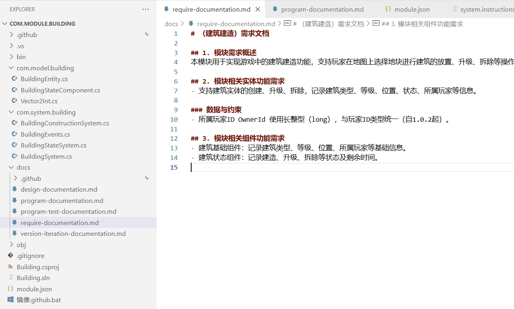

# EcsNode

基于Entity-Component-System的框架

支持热重载

# 游戏高效编程范式理念

- 数据逻辑分离（Component-System）

- 业务渲染分离（System-ViewSystem）

- 组合优于继承（Entity-Component，组合优于封装类，尤其是上层业务，当上层业务需要对封装好的类进行侵入式修改这是不好的设计，上层业务包括UI、动画、特效、场景渲染、消息处理等需求多变的场景）

- 领域驱动设计（EcsNode，领域可看做不同的业务场景，规划对齐需求粒度，降低协作理解成本）

- 高内聚低耦合（高内聚（模块化）优先于低耦合，浅传参（扁平化）优先于深传参，异常捕获优先于判空防御）

- 面向切面编程（避免侵入式编码）

- 规范化模块开发流（AI+）（Spec-Modular-Driven，类似于Kiro的Spec-Driven，基于copilot-instruction.md）

- 用面向过程的思维实现逻辑功能，用面向对象的思维设计数据结构

# AI+ 模块开发流程示例:
- Modules.Unity/com.module.chase（追逐模块）
- Modules.Unity/com.module.actor-state（角色状态模块）

- 常用prompt示例：
    - 补充完善require需求文档
    - 根据新修改的require文档，调整修改design文档

- 最新的AI+ 模块开发流程精简了文档数量，只保留require需求文档和design程序设计文档，并提升了文档的质量
- 另添加了model层和system层的API接口文档API_DOCS.md，方便开发者和AI大模型理解并扩展模块
- 最新的模块示例是 com.module.chase （追逐模块） 和 com.module.actor-state（角色状态模块）

copilot-instruction.md 里的都是自然语言描述的指导文档，亦可用于别的大模型指导文档，比如CLAUDE.md、cursor rule等

# SLG游戏demo（开发中）

- Modules.Unity/com.module.resource-data（资源模块）
- Modules.Unity/com.module.grid-based（网格系统）
- Modules.Unity/com.module.building（建筑建造模块）
- Modules.Unity/com.module.achieve（达成模块，用于成就和任务等）

# 帧同步demo（开发中）

方案一：仅预测移动，冲突即重置回滚重新预测（已实现）

方案二：预测碰撞事件缓存，先做特效表现，等待权威帧验证，验证通过则继续走逻辑，验证不通过则碰撞事件丢弃（未实现）

方案三：全部预测，缓存状态帧快照用以回滚（未实现）

- 帧同步demo，黄色物体是确定帧轨迹

## 关于目录管理
实际开发中，很多项目都没有做到很好的目录管理，大多都是这里写一个功能建一个文件夹，那里写一个功能建一个文件夹，非常混乱，项目大了之后维护成本会很高

就好比如用收纳盒收拾房间杂物，如果收纳盒大小形状不一，放的位置也杂乱无章，就会显得房间杂乱没有规律，东西无从找起

我们要做的就是用统一大小和形状的收纳盒，把杂物收集起来放到规定的地方

要做到规范的目录管理，首先需要做到合理的层级规划

EcsNode框架中使用了三级层级划分，域、层、块

域，代表领域、Ecs域，如UnityApp、Game、World等

层，代表层级，如数据层（业务数据层、视图数据层）、逻辑层（业务逻辑层、视图逻辑层）、引擎工具层

块，代表模块，如角色模块、战斗模块、移动模块等

基于这三级层级划分，定义规范的目录层次，重点看脚本的目录管理

脚本用了四级目录管理：

前2级都是基于层的目录

1、第一级按数据层和逻辑层划分，App.Model（数据模型层）和App.System（系统逻辑层）

2、第二级按业务类型进一步对层级进行细分，比如 Game.System（核心系统逻辑）、Game.ViewSystem（视图系统逻辑）、Unity.System（引擎系统逻辑）

3、第三级按ecs域划分，UnityApp、Game、World、UI、Scene
- 命名以 model.xxx、system.xxx 的格式来命名，这里的xxx是ecs域名称
- 第三方模块 放在 module.thirdparty.model、module.thirdparty.system 目录下
- 自定义的共用模块 放在 module.common.model、module.common.system 目录下

4、第四级按模块（实体和组件）进行划分，Actor、Item、MoveComponent等
- 模块文件夹命名以 com.model.xxx、com.system.xxx 的格式来命名

## 基于实体和组件的数据驱动
model
entity

## 面向系统和过程的业务开发
system
1vN

数据分散（把数据分散到多个组件，降低运行时内存负担）
逻辑收束（将逻辑归纳总结为统一系统，降低开发者理解负担）

将定义和理解一致

强调系统的归属

与C#传统写法一致

框架里有两种事件机制，一种是模块间接交互事件，一种是System接口事件

间接交互事件用于间接调用，用于虽然能直接调用到但不应该直接调用的时候，属于间接解耦

System接口事件用于动态派发，用于不应该直接调用也调用不到的时候，属于弱解耦，比如业务层触发视图层逻辑的时候

完全解耦的事件机制，比如字符串事件，这种过于灵活，并不推荐使用，会增加代码的维护和理解成本

模块间接交互事件是显示调用的，非动态派发，用于同一层级的模块之间交互，比如业务层级模块之间的交互（比如FireEvent、CollisionEvent），视图层级模块之间的交互（比如InputEvent）

System接口事件

框架通用System接口（比如IAwake、IDestroy），所有实体组件都适用，调用时无法明确接口参数，需要通过反射实现，需要注册（EcsNode.RegisterDrive）

业务指定System接口（比如IAfterRunEvent），适用于指定实体，调用时明确知道接口参数，可以直接通过接口调用，无需注册

## 提升开发效率的核心在于降低测试的时间和成本，提升测试的效率
首先是核心玩法逻辑，每次改逻辑或者加日志都需要重开游戏就非常浪费时间

这个可以通过逻辑热重载降低测试成本

再一个就是UI开发，UI的需求变动非常频繁，每次改ui逻辑和界面都需要重开游戏非常浪费时间

这个可以结合FGUI和代码生成实现界面和代码热更新降低测试成本

ui框架不需要使用ecs，因为ui界面天生就有主次之分，不需要通过实体和组件来区分主次

比如window就是主，button、text、image等都是包含在window之内的组件，主次一目了然

ui框架直接基于面向对象来实现

只有业务功能框架，一般主次区分不明显，需要用到ecs的实体和组件来区分主次，方便理解

过程是逻辑的梳理和复用

# 参考
- https://github.com/egametang/ET

- https://github.com/Leopotam/ecslite

- https://github.com/vovgou/loxodon-framework

- https://github.com/liyingsong99/FolderTag