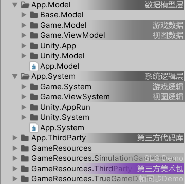
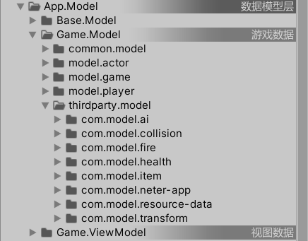
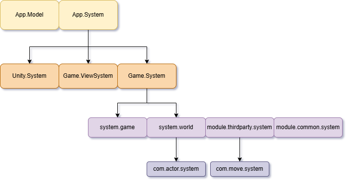
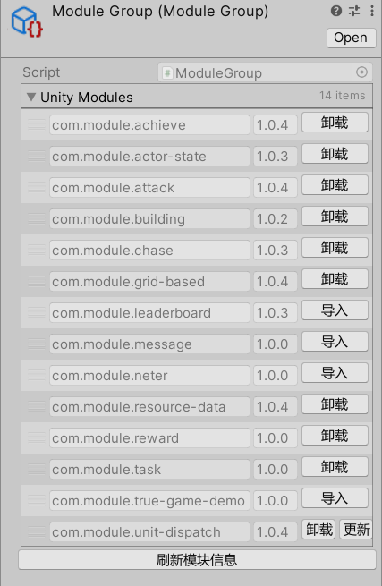
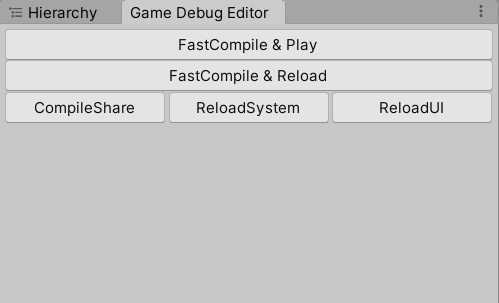
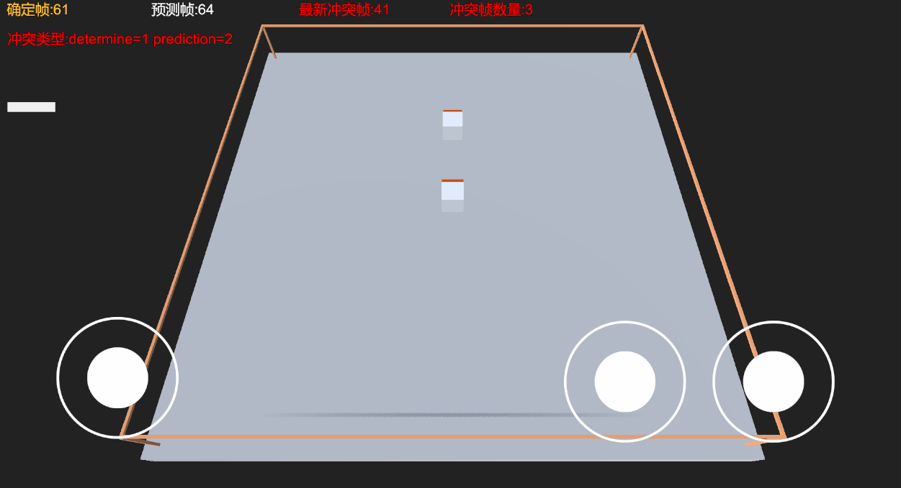

# EcsNode

基于 Entity-Component-System (ECS) 的框架，支持**热重载**。

## 核心理念 (Core Philosophy)

- **数据逻辑分离 (Component-System)**
- **业务渲染分离 (System-ViewSystem)**
- **组合优于继承 (Entity-Component)**
  - 组合优于封装类，尤其是上层业务。当上层业务（UI、动画、特效、场景渲染、消息处理等）需要对封装好的类进行侵入式修改时往往是不好的设计。
- **领域驱动设计 (Domain Driven Design)**
  - EcsNode 将领域看做不同的业务场景，规划对齐需求粒度，降低协作理解成本。
- **高内聚低耦合**
  - 高内聚（模块化）优先于低耦合。
  - 浅传参（扁平化）优先于深传参。
  - 异常捕获优先于判空防御。
- **面向切面编程**
  - 避免侵入式编码。
- **规范化模块开发流 (AI+)**
  - Spec-Modular-Driven (类似于 Kiro 的 Spec-Driven)。
  - 基于 `copilot-instruction.md`。
- **思维模式**
  - 用**面向过程**的思维实现逻辑功能。
  - 用**面向对象**的思维设计数据结构。

## 架构设计

### 目录管理
实际开发中，规范的目录管理如同收纳整理，能显著降低维护成本。EcsNode 使用三级层级划分：**域 (Domain)**、**层 (Layer)**、**块 (Module)**。

1.  **域**: 代表领域、ECS 域，如 UnityApp, Game, World 等。
2.  **层**: 代表层级，如数据层（业务/视图数据）、逻辑层（业务/视图逻辑）、引擎工具层。
3.  **块**: 代表模块，如角色模块、战斗模块、移动模块等。

**脚本目录结构 (四级管理):**

1.  **第一级 (层级划分)**:
    - `App.Model` (数据模型层)
    - `App.System` (系统逻辑层)
2.  **第二级 (业务类型细分)**:
    - `Game.System` (核心系统逻辑)
    - `Game.ViewSystem` (视图系统逻辑)
    - `Unity.System` (引擎系统逻辑)
3.  **第三级 (ECS 域划分)**:
    - 命名格式: `model.xxx`, `system.xxx` (xxx 为域名称，如 UnityApp, Game, World, UI, Scene)。
    - 第三方模块: `module.thirdparty.model`, `module.thirdparty.system`。
    - 自定义公共模块: `module.common.model`, `module.common.system`。
4.  **第四级 (模块划分)**:
    - 按实体和组件划分，如 Actor, Item, MoveComponent。
    - 文件夹命名格式: `com.model.xxx`, `com.system.xxx`。

### 数据驱动与业务开发

- **基于实体和组件的数据驱动**: Model, Entity。
- **面向系统和过程的业务开发**: System, 1vN。
  - **数据分散**: 将数据分散到多个组件，降低运行时内存负担。
  - **逻辑收束**: 将逻辑归纳总结为统一系统，降低开发者理解负担。
  - **一致性**: 定义和理解一致，强调系统的归属。

### 事件机制

框架包含两种事件机制：

1.  **全局接口事件**:
    - 通过EventBus.Send发送的事件会按顺序送达所有的Ecs域系统
    - 这个可以用来处理多个模块间的交互逻辑

2.  **系统接口事件**:
    - **框架通用 System 接口**: 如 `IAwake`, `IDestroy`。所有实体组件适用，通过反射实现。
    - **业务指定 System 接口**: 如 `IHealthChangeHandler`。适用于指定实体，调用时明确参数，可直接接口调用，无需注册（弱解耦）。

## AI+ 模块开发流程

基于前面清晰规范的 层级模块目录、Ecs模式以及事件机制，使用AI生成可维护可扩展的功能模块。

基于 `copilot-instruction.md` (自然语言描述的说明文档，适用于 Copilot, Claude, Cursor 等)。

- **核心文档**:
  - `require-documentation.md` (需求文档)
  - `design-documentation.md` (程序设计文档)
  - `API_DOCS.md` (Model 层和 System 层的 API 接口文档，辅助 AI 理解)
- **常用 Prompt**:
  - "补充完善 require 需求文档"
  - "根据新修改的 require 文档，调整修改 design 文档"
- **模块示例**:
  - `Modules.Unity/com.module.chase` (追逐模块)
  - `Modules.Unity/com.module.actor-state` (角色状态模块)

## 开发效率与热重载

核心在于降低测试时间和成本。

1.  **逻辑热重载**: 针对核心玩法逻辑，避免每次修改逻辑或日志都需要重启游戏。
2.  **UI 开发**: 结合 FGUI 和代码生成实现界面和代码热更新。
    - UI 框架不强制使用 ECS，因 UI 树状结构主次分明（Window -> Components），直接基于面向对象实现更自然。
    - ECS 主要用于业务功能框架，处理主次不明显的逻辑复用。

## Demos (开发中)

### SLG 游戏 Demo
- `Modules.Unity/com.module.resource-data` (资源模块)
- `Modules.Unity/com.module.grid-based` (网格系统)
- `Modules.Unity/com.module.building` (建筑建造模块)
- `Modules.Unity/com.module.achieve` (达成模块，成就/任务)
- `Modules.Unity/com.module.chase` (追逐模块)
- `Modules.Unity/com.module.actor-state` (角色状态模块)

### 帧同步 Demo
- **方案一**: 仅预测移动，冲突即重置回滚重新预测（已实现）。
- **方案二**: 预测碰撞事件缓存，先做特效表现，等待权威帧验证（未实现）。
- **方案三**: 全部预测，缓存状态帧快照用以回滚（未实现）。

*(图中黄色物体为确定帧轨迹)*

## 参考引用
- [ET](https://github.com/egametang/ET)
- [LeoECS Lite](https://github.com/Leopotam/ecslite)
- [Loxodon Framework](https://github.com/vovgou/loxodon-framework)
- [FolderTag](https://github.com/liyingsong99/FolderTag)